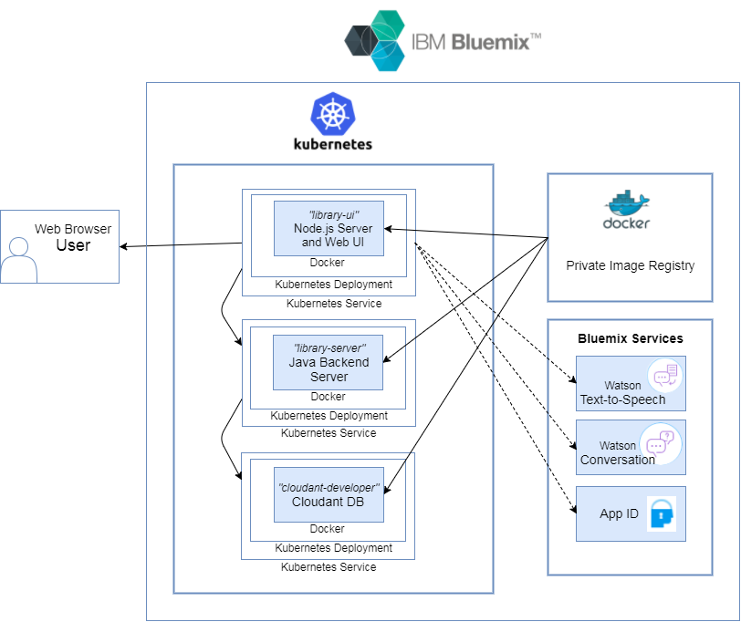
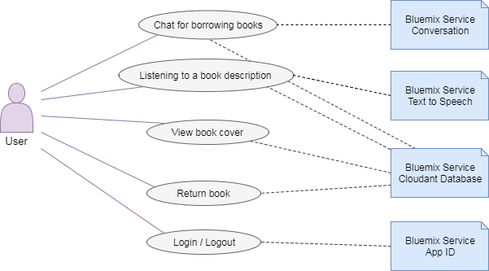
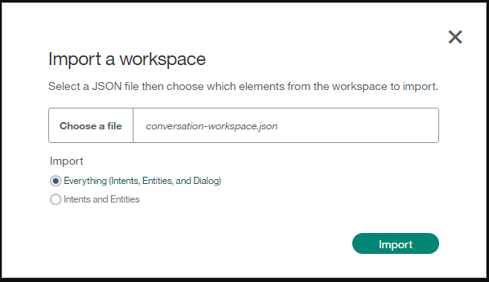
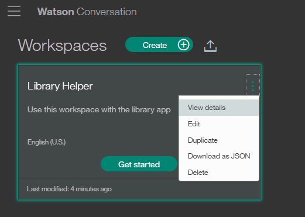

# Library Application

## Contents

* [Overview](#part0-0)
* [Prerequisites](#part0-1)
* The deployment steps
    1. [Create the Bluemix Services](#part1)
    2. [Connect to Bluemix on the command line](#part2)
    3. [Set up the Cloudant Developer Edition Container](#part3)
    4. [Add the Java and the Node.JS server to the cluster](#part4)

## Overview <a name="part0-0"></a>

This is a sample application running on kubernetes, and using Bluemix Services (Watson Conversation Service, TextToSpeech Service and App ID Service)

Once fully deployed, the web UI looks this:


The basic architecture of the application running on a Kubernetes cluster:



These are the use cases of the application:



## Prerequisites <a name="part0-1"></a>

  For this lab, you will need an [IBM BLuemix account](https://console.bluemix.net/registration/).

  The software needed for the following steps:
  * the Bluemix CLI: [Link](https://clis.ng.bluemix.net/ui/home.html)
  * IBM Bluemix Container Service plug-in:
      ```
      bx plugin install container-service -r Bluemix
      ```
  * Bluemix Container Registry plug-in:
      ```
      bx plugin install container-registry -r Bluemix
      ```
  * Docker CE CLI: [Link](https://www.docker.com/community-edition#/download)
  * Kubernetes CLI: [Link](https://kubernetes.io/docs/tasks/tools/install-kubectl/)
  * Git tool: ([Link](https://git-scm.com/downloads))

Clone this git repository.
```
git clone https://github.com/florae123/library-app-kubernetes
```

---

## 1. Create the Bluemix Services <a name="part1"></a>

Before running the two containers on a Kubernetes cluster on Bluemix, you need to create an instance of a Conversation Service, a TextToSpeech Service and an App ID service on Bluemix.

1. First, create a *Watson Conversation* service and copy the credentials to the Kubernetes Service configuration file.

  * Open the **catalog** in your Bluemix dashboard. Search for **Conversation**.
  * Select the **Conversation** service from the Bluemix Catalog, make sure the *Free* pricing plan is selected and click **Create**.
  * After being redirected the service's main page, open the **Manage** panel and click **Launch tool**.

    

  * Switch to the new tab or window, where the Conversation Management Tool has opened. Next to **Create workspace**, click the  **Import** icon.
  * Choose the file **conversation-workspace.json** from your local copy of the LibraryUI directory, select **Everything (Intents, Entities, and Dialog)**, and click **Import**.

    

  * Go **back to workspaces** and click **View Details** on the Libray Helper workspace.

    

  * Copy the **Workspace ID** to the clipboard.
  * In the file **libraryui-deployment.yaml**, replace the value for **conv_workspaceid** with your copied workspace ID, like this:
    ```
    - name: conv_workspaceid
       value: 1ec4b7df-07d8-4fca-9e79-909409b6d718
    ```

  * Go back to Bluemix in your browser. Open the **Service credentials** tab. If there are no credentials, add a *New credential*. Click **view credentials**. Copy and replace **username** and **password** for **CONVERSATION_USERNAME** and **CONVERSATION_PASSWORD**, respectively, in the file **libraryui-deployment.yaml**.

2. Create an instance of the *Watson Text-to-Speech* service by opening the catalog and selecting the service. Copy the credentials to the file **libraryui-deployment.yaml**; replace the values of **tts_username** and **tts_password** with the username and password in the credentials.

3. Create an instance of the *App ID* Service on Bluemix by selecting it from the catalog. Copy the corresponding values of the credentials into the following values in the file **libraryui-deployment.yaml**: *CLIENT_ID, OAUTH_SERVER_URL, SECRET, TENANT_ID*.

## 2. Connect to Bluemix on the command line <a name="part2"></a>

0. Open a terminal. Make sure you can run docker commands on this terminal.
1. Login to Bluemix using the command line:
    ```
    bx login -a https://api.eu-de.bluemix.net
    ```
    Depending on which region you want to use, you can change the API URL to https://api.eu-gb.bluemix.net for the United Kingdom or https://api.ng.bluemix.net.
    Enter the Email and Password for your Bluemix account and select your Organization and Space.

2. List all accessible clusters:
    ```
    bx cs clusters
    ```

3. Set the kubernetes configuration context with the **KUBECONFIG** env variable. Replace *<cluster_name>* with the name of the accessible cluster you want to use.
    ```
    bx cs cluster-config <cluster_name>
    ```
    When the download of the configuration files is finished, a command is displayed that you can use to set the path to the local Kubernetes configuration file as an environment variable.

4. Log in to the Bluemix Container Registry CLI. List the image repositories of the cluster.
    ```
    bx cr login
    bx cr namespace-list
    ```
    Create an image repository in the Bluemix Container Registry if you don't already have one. Choose a name to identify it.
    ```
    bx cr namespace-add <your_namespace>
    ```

## 3. Setup the Cloudant Developer Edition Container <a name="part3"></a>

For the library application, you need a Cloudant NoSQL Database.

You could also use the Cloudant Service from the Bluemix catalog. (If so, copy the credentials into the file *library-server.yaml* and change the value of the environment variable **CLOUDANT_DEVELOPER** to anything other than 1).

In this case, we will use the **ibmcom/cloudant-developer** image from Docker Hub.

1. Navigate to the folger **/library-app-kubernetes**. Create a deployment and a service for the databases:
    ```
    kubectl create -f cloudant-developer.yaml
    ```
    To check if the service was created:
    ```
    kubectl get services
    ```
    There should be a service named *cloudant-developer* in the list.

2. Configure the databases:

    1. Copy the name of the pod starting with **cloudant-developer**.
        ```
        kubectl get pods
        ```

        

    2. Use the port-forward command to access the service on **http://localhost:80/dashboard.html**
        ```
        kubectl port-forward <cloudant_dev_pod_name> 80:80
        ```

        
    3. Enter the username **admin** and the password **pass**.
    4. Create a database called **"books"**.

        

        A book will be saved as a JSON in the following format:

          ```
        	{
        	  "_id": "...",
        	  "_rev": "...",
        	  "id": "id must be the same as _id",
        	  "isbn": "the book's isbn",
        	  "authors": [
        	    "the book's author"
        	  ],
        	  "title": "bookTitle",
        	  "tags": [
        	    "Keywords", "that match", "the book"
        	  ],
        	  "picture": "the book's cover",
        	  "about_the_book": "a description to be read by Text to Speech"
        	}
          ```

        There are some sample documents in this format in the *sample-books* folder in this directory. To include any of these books in your database:
        * Click on the database **books** and then click the **+** sign next to **All Documents**.
        * Select **New Doc**.
        * Delete the default *{ "id_": "..." }* and copy the text in one of the json files into the document.
        * Click **Create Document**.

        There is no **"_rev"** attribute included in the sample json data.
        This is because the *"_rev"* attribute has to be excluded from new data that is added to a database. The Cloudant service will automatically generate the attribute-value pair *"_rev"*.

        In order for the app to be able to properly search this database, create a new search index and two new views in "books".
        To do this:
        * Click the **+** sign next to **All Documents**
        * Select **New Doc**, delete the default *{ "id_": "..." }*
        * Copy the text from the file **cloudant-design-docs/cloudant-design-doc-books.json** into the document.
        * Click **Create Document**.

    5. Create a database called **"customers"**. A customer will be saved as a JSON in the following format:

        ```
      	{
      	  "_id": "the customer's id",
          "_rev": "...",
      	  "name": "the customer's name",
      	  "email": "the customer's email address",
      	  "password": "the customer's password",
      	  "id": "must be the same as _id"
      	}
        ```
        Add a search index from the file **cloudant-design-docs/cloudant-design-doc-customers.json** as described in the previous step.

    6. Create a database called **"rentals"**. Whenever a book is borrowed, it is registered in "rentals". A rental will be saved as a JSON in the following format:

        ```
        {
          "_id": "the rental's id",
          "_rev": "...",
          "id": "must be the same as _id",
          "bookid": "the id of the book borrowed",
          "customerid": "the id of the customer borrowing the book",
          "start": "Mar 3, 2017 12:00:00 AM",
          "end": "May 4, 2017 12:00:00 AM"
        }
        ```
        Add a search index from the file **cloudant-design-docs/cloudant-design-doc-rentals.json**.

    7. To return to the normal command line, press **Ctrl+C** in the terminal.

## 4. Add the Java and the Node.JS server to the cluster <a name="part4"></a>

1. Build the docker images locally. Replace *<region>* with the Bluemix region you are using and *<namespace>* with the name of your namespace.
    ```
    docker build -t registry.<region>.bluemix.net/<namespace>/library-server:v1 ./library-server-java
    docker build -t registry.<region>.bluemix.net/<namespace>/library-ui:v1 ./Libraryui
    ```
    Wait until the builds are complete.

2. Push the images to your registry namespace and wait for them to finish.
    ```
    docker push registry.<region>.bluemix.net/<namespace>/library-server:v1
    docker push registry.<region>.bluemix.net/<namespace>/library-ui:v1
    ```

3. In the file **library-server.yaml**, change the name of the image in line 32 to **registry._region_.bluemix.net/_namespace_/library-server:v1**.

    In the file **library-ui-deployment.yaml**, change the name of the image to **registry._region_.bluemix.net/_namespace_/library-ui:v1** in line 15.

4. Create a deployment and a service for the java backend in your cluster.
    ```
    kubectl create -f library-server.yaml
    ```

5. Create a service for the Node.js server and frontend in your cluster and expose it.
    ```
    kubectl create -f library-ui-service.yaml
    ```

6. Get a list of the services in the cluster and copy the **EXTERNAL-IP** of the service **library-ui**.
    ```
    kubectl get services
    ```

    

    

    Open the file **library-ui-deployment.yaml** and change the value for **APP_URL** to **http://<EXTERNAL-IP_library-ui>:30832** line 23, like
    ```
    env:
    -name: APP_URL
        value: http://159.122.69.139:30832
    ```

7. Create a deployment for the the Node.js server and frontend.
    ```
    kubectl create -f library-ui-deployment.yaml
    ```

8. Open **http://<EXTERNAL-IP_library-ui>:30832** in a browser and log in using a facebook or google account.
